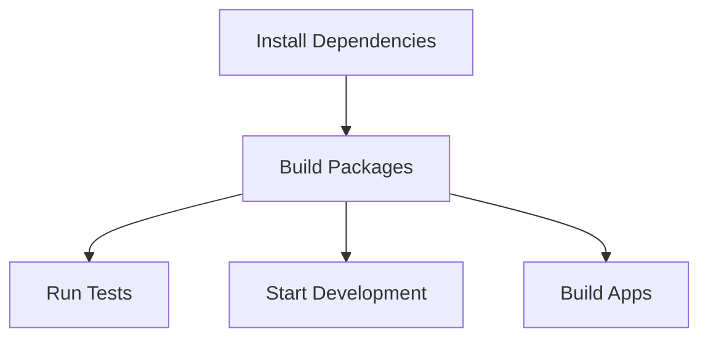

## Overview

[Turborepo](https://turbo.build/) is our build system orchestration tool that helps us manage our monorepo efficiently. It provides:

- **Intelligent Build Caching**: Speeds up builds by caching task outputs
- **Task Pipeline Management**: Defines dependencies between tasks across packages
- **Parallel Execution**: Runs tasks in parallel when possible
- **Workspace Management**: Handles dependencies between packages effectively

## Configuration

### Root Configuration

Our root `turbo.json` defines the core pipeline and task configurations:

```json
{
  "$schema": "https://turbo.build/schema.json",
  "globalDependencies": [".env"],
  "pipeline": {
    "build": {
      "dependsOn": ["^build"],
      "outputs": ["dist/**"]
    },
    "test": {
      "dependsOn": ["^build"],
      "inputs": ["src/**/*.tsx", "src/**/*.ts", "test/**/*.ts", "test/**/*.tsx"]
    },
    "lint": {
      "outputs": []
    },
    "dev": {
      "cache": false,
      "persistent": true
    }
  }
}
```

### Workspace Setup

Our workspaces are defined in `pnpm-workspace.yaml`:

```yaml
packages:
  - 'apps/*'
  - 'packages/*'
```

## Task Pipeline

### Core Tasks

1. **Build**
   ```bash
   pnpm build
   ```
   - Builds all packages and applications
   - Respects dependencies between packages
   - Caches build outputs for faster subsequent builds

2. **Development**
   ```bash
   pnpm dev --filter <app-name>
   ```
   - Starts development server for specific application
   - Watches for changes in dependencies
   - No caching for development tasks

3. **Testing**
   ```bash
   pnpm test
   ```
   - Runs tests across all packages
   - Caches test results when possible
   - Depends on build task completion

4. **Linting**
   ```bash
   pnpm lint
   ```
   - Runs linting across all packages
   - Quick execution with caching

### Task Dependencies

Our pipeline ensures tasks run in the correct order:



## Development Workflow

### Running Tasks

1. **Building Specific Packages**
   ```bash
   pnpm build --filter @sfh/backend
   ```

2. **Development Mode**
   ```bash
   # Start specific app
   pnpm dev --filter admin
   
   # Start multiple apps
   pnpm dev --filter admin --filter docs
   ```

3. **Testing**
   ```bash
   # Test specific package
   pnpm test --filter @sfh/testing
   
   # Test with dependencies
   pnpm test --filter @sfh/admin...
   ```

### Cache Management

1. **Local Cache**
   - Located in `.turbo` directory
   - Automatically manages task outputs
   - Can be safely deleted to clear cache

2. **Remote Cache**
   - Configured for Vercel deployment
   - Shares cache across team members
   - Speeds up CI/CD pipelines

### Filtering

We use Turborepo's powerful filtering syntax:

```bash
# Single workspace
pnpm <task> --filter <workspace>

# Workspace and dependencies
pnpm <task> --filter <workspace>...

# Workspace and dependents
pnpm <task> --filter ...<workspace>

# Since last change
pnpm <task> --since=origin/main
```

## Best Practices

### Pipeline Configuration

1. **Task Dependencies**
   - Use `dependsOn` to define prerequisites
   - Include `^build` for tasks requiring built packages
   - Mark development tasks as `persistent`

2. **Output Caching**
   - Define `outputs` for cacheable tasks
   - Use `cache: false` for watch mode tasks
   - Include all generated files in outputs

3. **Task Inputs**
   - Specify `inputs` to track relevant files
   - Include test files for test tasks
   - Include configuration files when needed

### Workspace Organization

1. **Package Structure**
   - Keep related code in same workspace
   - Share common code through packages
   - Minimize cross-workspace dependencies

2. **Dependencies**
   - Use workspace protocol for local dependencies
   - Keep shared dependencies at root
   - Version lock important packages

### Performance Tips

1. **Cache Optimization**
   - Regular cache pruning
   - Precise output definitions
   - Minimal global dependencies

2. **Task Execution**
   - Use specific filters when possible
   - Leverage parallel execution
   - Monitor task dependencies

## Common Commands

### Development

```bash
# Start development
pnpm dev --filter admin

# Build specific package
pnpm build --filter @sfh/backend

# Watch mode for package
pnpm watch --filter @sfh/ui
```

### Testing

```bash
# Run all tests
pnpm test

# Test specific app
pnpm test --filter admin

# Test with dependencies
pnpm test --filter admin...
```

### Maintenance

```bash
# Clean all caches
pnpm turbo clean

# Prune old cache entries
pnpm turbo prune

# Generate dependency graph
pnpm turbo graph
```

## Resources

- [Turborepo Documentation](https://turbo.build/repo/docs)
- [Monorepo Handbook](https://turbo.build/repo/docs/handbook)
- [Task Caching](https://turbo.build/repo/docs/core-concepts/caching)
- [CLI Reference](https://turbo.build/repo/docs/reference/command-line-reference) 