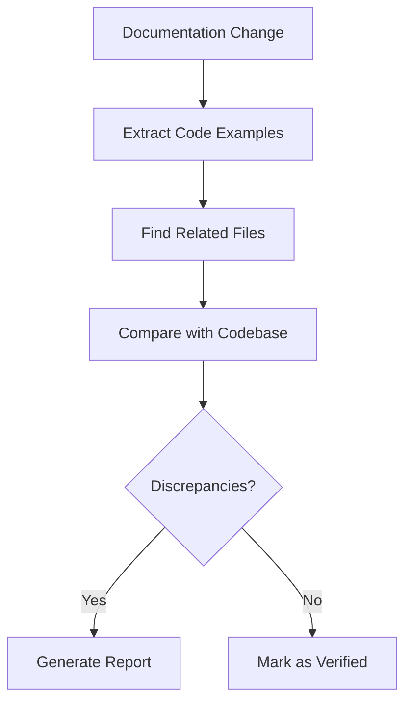

## Overview

Our Documentation Management team ensures the accuracy and quality of our technical documentation through a combination of expert review and automated validation. We focus on maintaining perfect synchronization between our documentation and codebase.

## Documentation Review Operations

### Core Capabilities

Our documentation review system specializes in:

**Code Synchronization**
- Validates code examples against actual codebase
- Detects discrepancies in real-time
- Ensures documentation reflects current implementation
- Tracks related files and dependencies

**Documentation Standards**
- Maintains consistent documentation structure
- Validates technical accuracy
- Ensures comprehensive coverage
- Monitors documentation health

### Review Process

Our systematic review process includes:

**Automated Validation**

**Review Components**
- Code example verification
- Related file identification
- Semantic comparison
- Discrepancy reporting

### Quality Standards

We maintain documentation quality through:

**Validation Criteria**
- Code accuracy (greater than 95% match rate)
- Technical correctness
- File reference accuracy
- Structural integrity

**Documentation Requirements**
- Up-to-date code examples
- Accurate file references
- Clear technical explanations
- Proper formatting

## Reporting System

### Report Generation

Our system generates comprehensive reports including:

**Content Analysis**
- Code discrepancies found
- File reference validation
- Technical accuracy assessment
- Quality metrics

**Review Details**
- Specific discrepancies
- Context and explanations
- Recommended actions
- Priority levels

### Communication Channels

Review findings are distributed through:

- **GitHub Discussions**: Primary review channel
- **Documentation Health Reports**: Regular status updates

## Performance Metrics

### Current KPIs

We track our performance through:

**Accuracy Metrics**
- Documentation-code sync rate: greater than 95%
- False positive rate: less than 5%
- Resolution rate: greater than 90%

**System Performance**
- Review completion time
- Discrepancy detection rate
- Report generation speed
- System availability

## Support & Contact

For documentation review assistance:

- **Review Requests**: GitHub Discussions board
- **General Questions**: Email the documentation team
